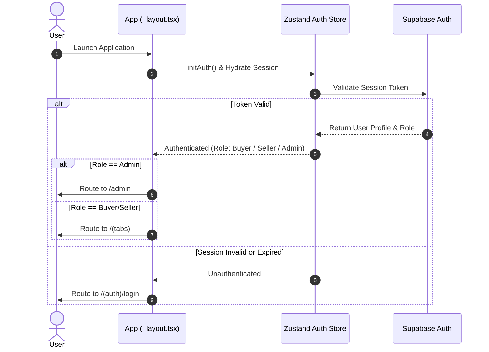
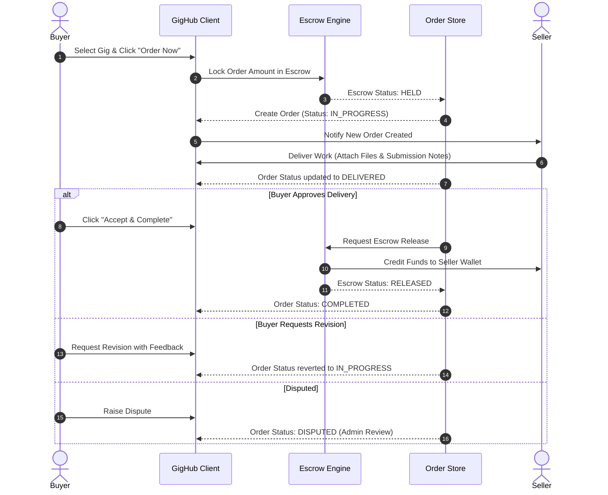
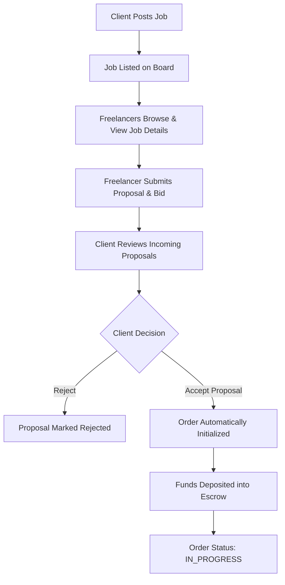
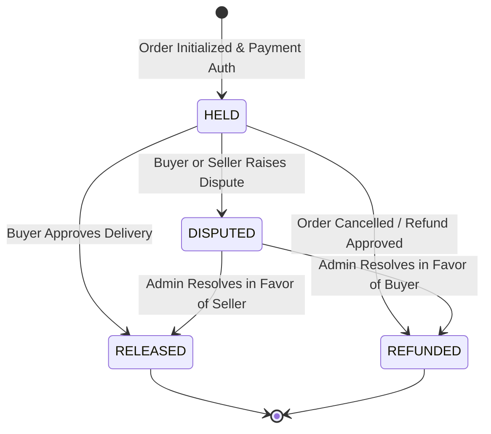
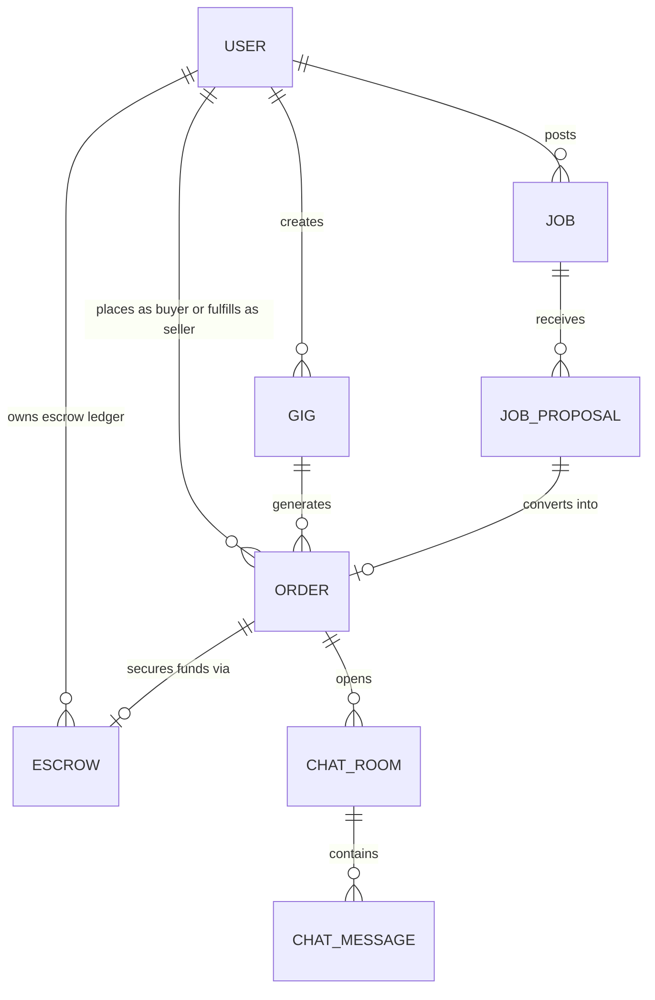

# 🚀 GigHub - Freelance & Talent Marketplace Platform

**GigHub** is a modern, high-performance cross-platform mobile and web application designed for the freelance economy. Built with **React Native**, **Expo (v54)**, **Expo Router (v6)**, **NativeWind (Tailwind CSS v3)**, **Zustand**, and **Supabase**, GigHub seamlessly connects buyers (clients) with freelancers (sellers) to discover services, submit custom job proposals, execute orders safely through an integrated escrow system, and collaborate in real-time.

---

## 📑 Table of Contents
1. [Architecture & Tech Stack](#-architecture--tech-stack)
2. [System Architecture Diagram](#-system-architecture-diagram)
3. [Key Features](#-key-features)
4. [Application Workflow Diagrams](#-application-workflow-diagrams)
   - [Authentication & Role Routing](#1-authentication--role-based-navigation-flow)
   - [Gig Order & Escrow Lifecycle](#2-gig-order--escrow-fulfillment-lifecycle)
   - [Job Posting & Proposal Selection Flow](#3-job-posting--proposal-selection-flow)
   - [Escrow State Machine](#4-escrow-financial-state-machine)
5. [Directory Structure](#-directory-structure)
6. [State Management & Data Flow](#-state-management--data-flow)
7. [Data Models & Schema](#-data-models--schema)

---

## 🛠 Architecture & Tech Stack

GigHub is structured using modern React Native and Expo standards with full TypeScript coverage and modular state stores:

| Layer | Technologies Used |
| :--- | :--- |
| **Framework & Engine** | React Native (0.81.5), Expo (v54), React 19 |
| **Routing & Navigation** | Expo Router (v6) file-based routing with Stack & Tabs |
| **Styling & Theme** | NativeWind (v4 / Tailwind CSS v3), Dark Mode ambient design system |
| **State Management** | Zustand (v5) with Async Storage hydration |
| **Backend & Auth** | Supabase JS (v2), REST API client with Axios |
| **UI & Gestures** | React Native Reanimated (v4), React Native Gesture Handler |
| **Media & Uploads** | Expo Image, Expo Image Picker, Expo Document Picker |
| **Validation** | Zod schema validation |

---

## 📐 System Architecture Diagram

```mermaid
graph TD
    subgraph Client Layer (React Native / Expo App)
        UI[UI Components & Screens]
        Navigation[Expo Router Navigation Stack/Tabs]
        Stores[Zustand State Stores]
    end

    subgraph Business Logic & Utilities
        Validations[Zod Schemas]
        Uploader[File & Asset Manager]
        APIClient[Axios & Supabase API Client]
    end

    subgraph External & Backend Services
        SupaAuth[Supabase Auth Service]
        SupaDB[(Supabase Database)]
        CloudStorage[Cloud Storage / R2]
    end

    UI --> Navigation
    UI --> Stores
    Stores --> APIClient
    Stores --> Validations
    APIClient --> SupaAuth
    APIClient --> SupaDB
    Uploader --> CloudStorage
```

---

## 🌟 Key Features

### 🛒 1. Gig Marketplace
- **Browse & Search**: Filter gigs by category, price, and ratings with interactive search.
- **Detailed Service Pages**: Includes packages, deliverables, seller profiles, media galleries, and user reviews.
- **Gig Creation**: Multi-step gig creation wizard with pricing tiers, delivery duration, tag assignment, and media uploads.

### 💼 2. Job Board & Proposal System
- **Client Job Posting**: Post customized freelance opportunities with budget range, deadline, category, and skill requirements.
- **Proposal Submission**: Freelancers submit bids featuring cover letters, delivery timelines, price proposals, and attachments.
- **Proposal Acceptance**: Clients review incoming proposals and accept bids, automatically generating a locked order and escrow record.

### 🔒 3. Order Execution & Escrow Management
- **Order Lifecycle States**: `Pending` ➔ `In Progress` ➔ `Delivered / In Review` ➔ `Completed` (or `Disputed` / `Cancelled`).
- **Escrow Financial Safety**: Client funds are automatically held in escrow upon order creation and safely released to the seller upon completion.
- **Swipeable Order Cards**: Quick gesture actions to chat, view progress, submit work, or request revisions.
- **Deliverable Submission System**: Work submission interface supporting multi-file attachments and notes.

### 💬 4. Real-Time Messaging & Chat
- **Direct Messaging**: Dedicated chat rooms between buyers and sellers connected to specific gigs or job orders.
- **Message History & Media**: In-chat file and image sharing with message timestamps.

### 💳 5. Wallet & Financial Ledger
- **Virtual Balance & Escrow Ledger**: Track total balance, pending escrow, and withdrawable funds.
- **Transaction History**: Comprehensive record of deposits, payouts, escrow holds, and refunds.

### 🛡 6. Admin Panel
- **Platform Analytics**: Monitor overall platform user growth, active orders, and financial metrics.
- **User Governance**: View user lists, toggle user account statuses, manage user roles (Buyer, Seller, Admin).
- **System Configuration**: Control announcements, ad banners, categories, and system flags.

---

## 🔄 Application Workflow Diagrams

### 1. Authentication & Role-Based Navigation Flow



---

### 2. Gig Order & Escrow Fulfillment Lifecycle



---

### 3. Job Posting & Proposal Selection Flow



---

### 4. Escrow Financial State Machine



---

## 📁 Directory Structure

```
app/
├── (auth)/                  # Authentication routes (login, signup)
├── (tabs)/                  # Main application tab navigation
│   ├── index.tsx            # Home screen (Featured Gigs, Jobs, Banners)
│   ├── explore.tsx          # Search & filter marketplace screen
│   ├── orders.tsx           # Buyer & Seller order dashboard
│   ├── chat.tsx             # Active conversations list
│   └── profile/             # Profile management & dashboard sub-routes
│       ├── index.tsx        # Profile overview & quick links
│       ├── create-gig.tsx   # Multi-step gig builder
│       ├── post-job.tsx     # Custom job posting screen
│       ├── my-gigs.tsx      # Freelancer's active gigs
│       ├── my-jobs.tsx      # Client's posted jobs
│       ├── escrow.tsx       # Escrow transactions monitor
│       ├── wallet.tsx       # Financial balance & payouts
│       ├── applied-jobs.tsx # Proposals submitted tracker
│       └── incoming-proposals.tsx # Job proposal review interface
├── admin/                   # Admin portal routes
│   ├── index.tsx            # Analytics dashboard
│   └── users.tsx            # User management matrix
├── chat/                    # Real-time chat room screen ([conversationId].tsx)
├── gig/                     # Detailed Gig page ([slug].tsx)
├── job/                     # Detailed Job page ([slug].tsx)
├── order/                   # Comprehensive Order details & delivery screen ([id].tsx)
└── unauthorized.tsx         # Guard page for unauthenticated / unauthorized access

components/
├── ui/                      # Reusable UI library (Buttons, Cards, Inputs, Badges, Toast)
├── home/                    # Banners, Search bar, Category scroller
├── gigs/                    # Gig cards, Package selectors, Media preview
├── jobs/                    # Job cards, Proposal dialogs
└── orders/                  # Order status pills, Deliverables, SwipeableOrderCard

store/                       # Zustand State Stores
├── auth.store.ts            # Auth session, roles, user state
├── gigs.store.ts            # Marketplace gigs state & filters
├── jobs.store.ts            # Job board state
├── job-proposals.store.ts   # Proposals submission & management store
├── orders.store.ts          # Order creation, deliverables, status transitions
├── escrow.store.ts          # Escrow funds locking, releases, refunds
├── chat.store.ts            # Chat rooms, messaging, attachments
├── wallet.store.ts          # Financial balance, deposit/withdrawal history
├── users.store.ts           # Admin user management store
└── admin-dashboard.store.ts # System analytics store

types/                       # TypeScript Interface Definitions
├── db/                      # Supabase DB entities (Gig, Job, Order, Escrow, etc.)
└── business/                # Business logic types (User, Chat, File, R2)
```

---

## 📦 State Management & Data Flow

GigHub utilizes **Zustand** stores designed for clear separation of concerns and reactivity:

- **`useAuthStore`**: Controls session initialization, persistence with `AsyncStorage`, authentication headers, and active user profile.
- **`useOrdersStore`**: Manages order statuses (`pending`, `in_progress`, `delivered`, `completed`, `cancelled`, `disputed`), deliverable uploads, and revision requests.
- **`useEscrowStore`**: Synchronizes escrow balance with order lifecycle events, protecting buyer funds until completion.
- **`useChatStore`**: Handles active conversations, message thread polling/subscriptions, and message payload dispatches.
- **`useGigsStore` & `useJobsStore`**: Provide search filtering, pagination, and optimistic updates for marketplace listings.

---

## 🗄 Data Models & Schema

The core database entity relationships in GigHub:


