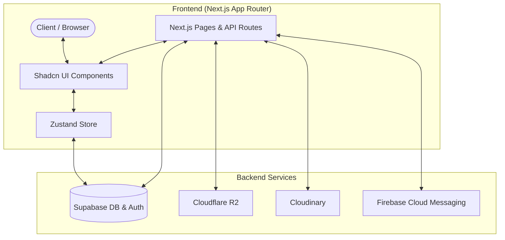

# Gighub

Gighub is a modern freelance and job marketplace application built with Next.js and React. It provides a platform for users to create gigs, post jobs, submit proposals, and manage orders seamlessly.

## Tech Stack

- **Framework:** Next.js (App Router)
- **UI Library:** React, Shadcn UI, Radix UI
- **Styling:** Tailwind CSS v4, Framer Motion
- **State Management:** Zustand
- **Database & Auth:** Supabase
- **Storage:** Cloudflare R2, Cloudinary
- **Notifications:** Firebase Cloud Messaging

## Architecture Overview

## Key Features

- **Gig & Job Management:** Create, view, and manage gigs and job postings.
- **Order Management:** Track order statuses, accept, or cancel orders directly from the dashboard.
- **User Profiles:** Comprehensive profile management for both buyers and sellers.
- **Real-time Notifications:** Integrated with Firebase Cloud Messaging for timely updates.
- **Media Optimization:** Fast image delivery and processing via Cloudinary and Cloudflare R2.
