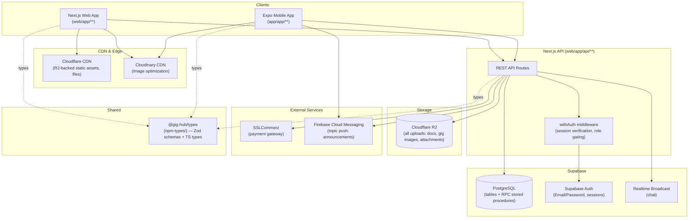
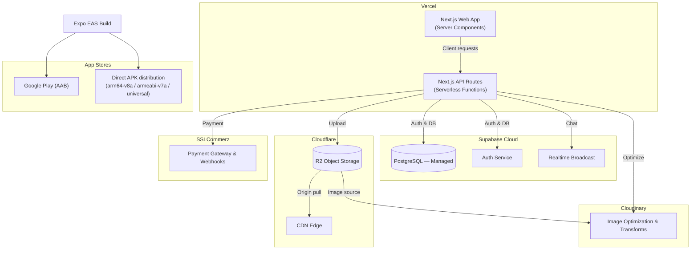

# 2. Tech Stack & System Architecture

## 2.1 Tech Stack

### Web (`web/` — Next.js)

| Layer              | Technology                                                   |
| ------------------ | ------------------------------------------------------------ |
| Framework          | Next.js (App Router), React                                  |
| UI                 | Shadcn UI, Radix UI, Tailwind CSS v4, Framer Motion          |
| State management   | Zustand                                                      |
| Database & Auth    | Supabase (PostgreSQL + Supabase Auth + Realtime Broadcast)   |
| File storage       | Cloudflare R2 (all files)                                    |
| Image CDN          | Cloudinary (banners, gig images, avatars only)               |
| Push notifications | Firebase Cloud Messaging (`firebase-admin`, topic messaging) |
| Payments           | SSLCommerz                                                   |
| Shared types       | `@gig-hub/types` (Zod schemas + TS types)                    |

### Mobile (`app/` — Expo)

| Layer              | Technology                                                     |
| ------------------ | -------------------------------------------------------------- |
| Framework & engine | React Native 0.81.5, Expo v54, React 19                        |
| Routing            | Expo Router v6 (file-based, Stack + Tabs)                      |
| Styling            | NativeWind v4 (Tailwind CSS v3), dark-mode-first design system |
| State management   | Zustand v5 + AsyncStorage hydration                            |
| Backend client     | Axios REST client + Supabase JS v2                             |
| Gestures/animation | React Native Reanimated v4, React Native Gesture Handler       |
| Media              | Expo Image, Expo Image Picker, Expo Document Picker            |
| Notifications      | `expo-notifications`, `expo-device`                            |
| Validation         | Zod (`@gig-hub/types`)                                         |

### Shared

- **`npm-types/`** — standalone package `@gig-hub/types`, published as a `.tgz`/npm dependency and consumed by both `web/` and `app/`. Contains `src/validations/*.schema.ts` (Zod schemas — the single source of truth for request/response shapes) and `src/types/{db,business}` (derived TypeScript types).

## 2.2 High-Level Architecture



**Key principle:** the mobile app never talks to Supabase or R2/Cloudinary directly for writes — it always goes through the Next.js API in `web/app/api/**`, which owns auth verification, business rules, and calls Postgres RPC (stored procedures) for anything financial (orders, escrow, wallet). This keeps all money-moving logic in one place (the database transaction), regardless of which client initiated the request.

## 2.3 Deployment Topology (target)



See [10-deployment.md](./10-deployment.md) for build/release details (EAS profiles, environment variables, CI).

## 2.4 Backend Layering Convention (`web/`)

```
web/app/api/**/route.ts   → thin HTTP handlers: parse+validate (Zod), call service, shape response, wrap in withAuth()
web/services/*.service.ts → business logic: talks to Supabase client / calls RPC stored procedures
web/lib/validations/*.ts  → local Zod schema shims (route-internal, layered on top of @gig-hub/types)
web/schema/*.sql           → source of truth for DB tables, enums, RLS, triggers, stored procedures
web/store/*.ts             → Zustand stores for the Next.js *web frontend* (not the API)
```

## 2.5 Mobile Layering Convention (`app/`)

```
app/app/**              → Expo Router file-based screens (Stack + Tabs)
app/store/*.store.ts     → Zustand stores: session, domain data, pagination, optimistic updates
app/lib/**               → API clients (Axios), notification handling, utility helpers
app/components/**        → Reusable UI, feature-scoped component folders (gigs/, jobs/, orders/, home/)
app/types/**             → TypeScript types (db/ mirrors Supabase entities, business/ is app-specific)
```
