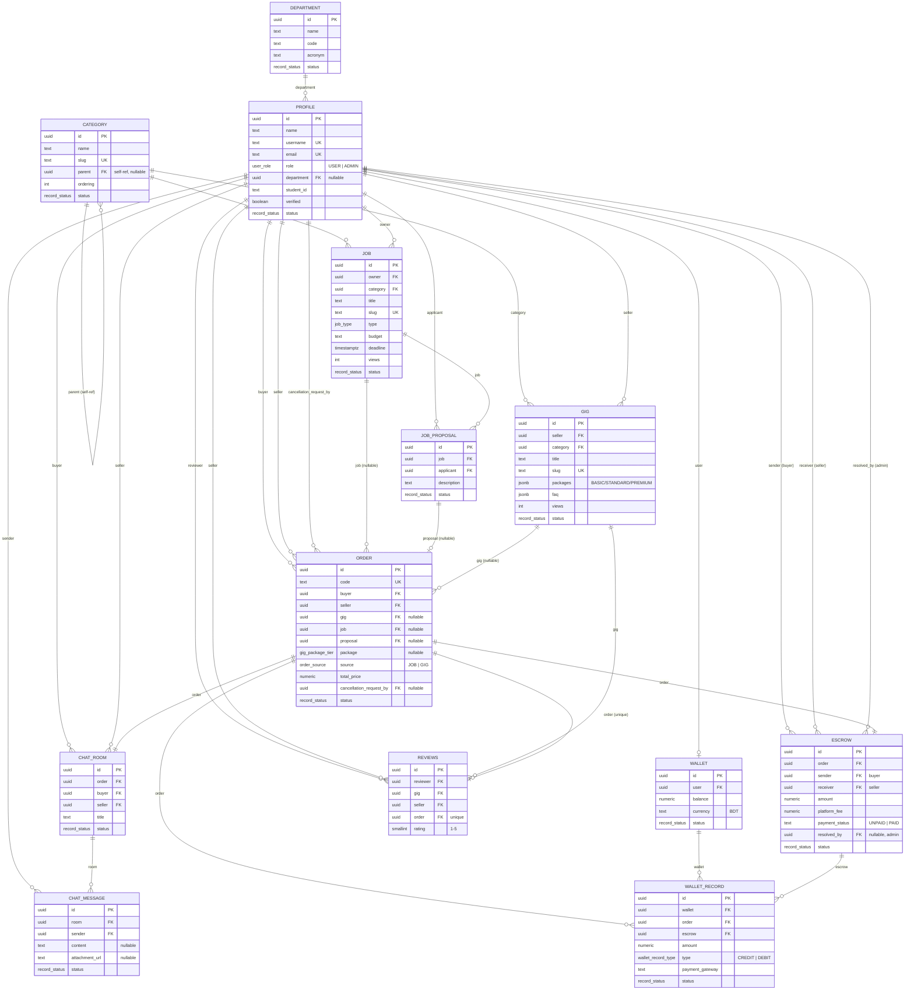

# 4. Entity-Relationship Diagram

> Derived directly from the applied SQL migrations in [`web/schema/`](../../web/schema) — see [03-database-schema.md](./03-database-schema.md) for full column-level detail. `department`, `category`, and `profile` are the root entities; everything else hangs off `profile`, `gig`, `job`, and `"order"`.

## 4.1 Relationship Notes

- **`"order"` is the hub entity.** Every order has exactly **one** `escrow` (1:1) and **one** `chat_room` (1:1), and can have at most **one** `reviews` row (1:0..1, enforced by `UNIQUE("order")`).
- **Polymorphic sourcing:** an order is sourced from _either_ a `gig` (direct purchase, `source = GIG`, `package` populated) _or_ a `job` + `job_proposal` (`source = JOB`). Both FK columns are nullable on `"order"` for this reason — application/RPC logic enforces exactly one path is populated per `source`.
- **`profile` fan-out:** a single `profile` row participates in up to 8 different relationships (seller of gigs, owner of jobs, applicant of proposals, buyer/seller of orders, buyer/seller of chat rooms, sender of messages, sender/receiver/resolver of escrow, reviewer/reviewed in reviews) — this is what makes the "every student is dual-sided" product model possible without separate account types.
- **`category` is a self-referencing tree** (`parent → category.id`) supporting nested subcategories for both gigs and jobs.
- **`wallet_record` is the append-only ledger** joining `wallet` (whose balance it should reconcile to) with the `order`/`escrow` pair that generated it — this is what the admin dashboard and per-user transaction history are built from.
- Admins are not a separate table — `profile.role = 'ADMIN'` plus RLS `is_admin()` checks gate elevated access (dispute resolution, content management, user governance).

## 4.2 Cardinality Summary

| Relationship                            | Cardinality |
| --------------------------------------- | ----------- |
| `profile` → `gig` (as seller)           | 1 : N       |
| `profile` → `job` (as owner)            | 1 : N       |
| `job` → `job_proposal`                  | 1 : N       |
| `job_proposal` → `"order"`              | 1 : 0..1    |
| `gig` → `"order"`                       | 1 : N       |
| `"order"` → `escrow`                    | 1 : 1       |
| `"order"` → `chat_room`                 | 1 : 1       |
| `"order"` → `reviews`                   | 1 : 0..1    |
| `chat_room` → `chat_message`            | 1 : N       |
| `wallet` → `wallet_record`              | 1 : N       |
| `escrow` → `wallet_record`              | 1 : N       |
| `category` → `category` (subcategories) | 1 : N       |
| `department` → `profile`                | 1 : N       |
