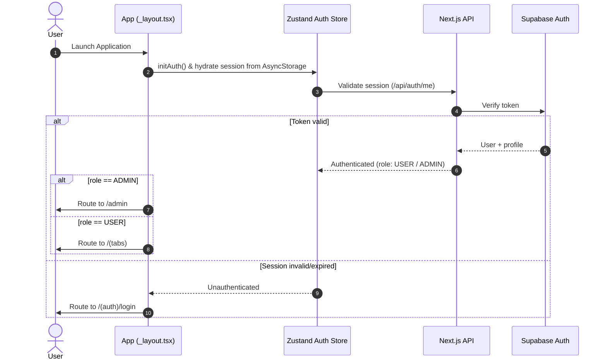
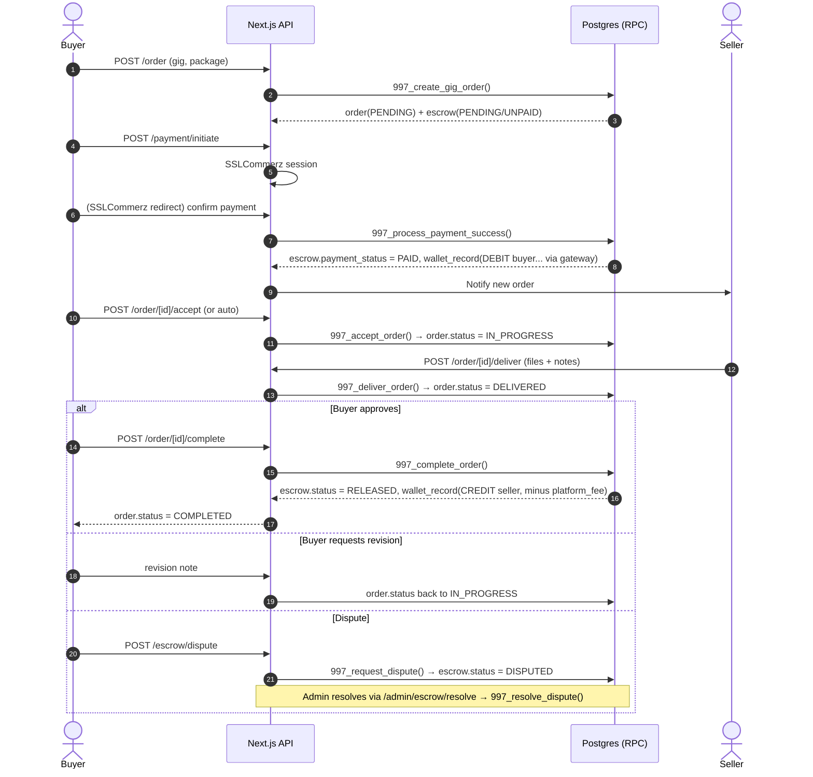
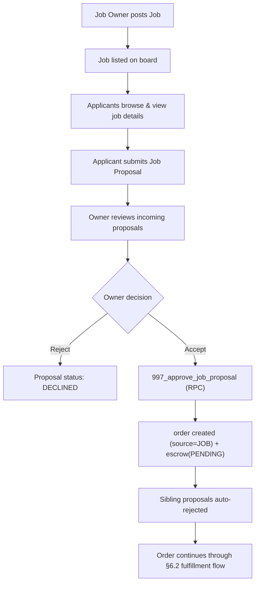
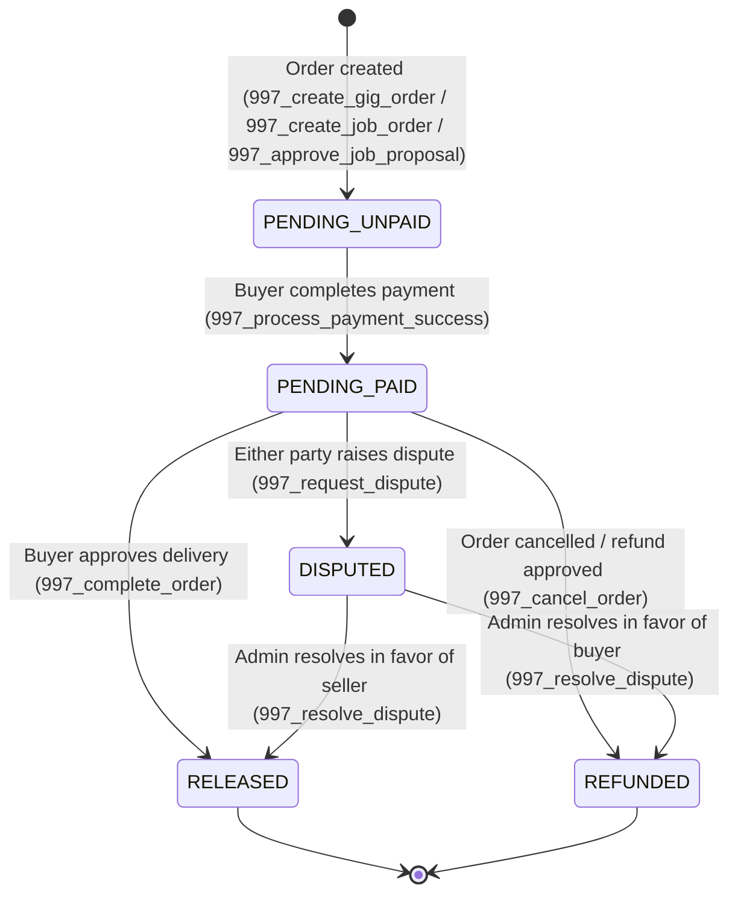
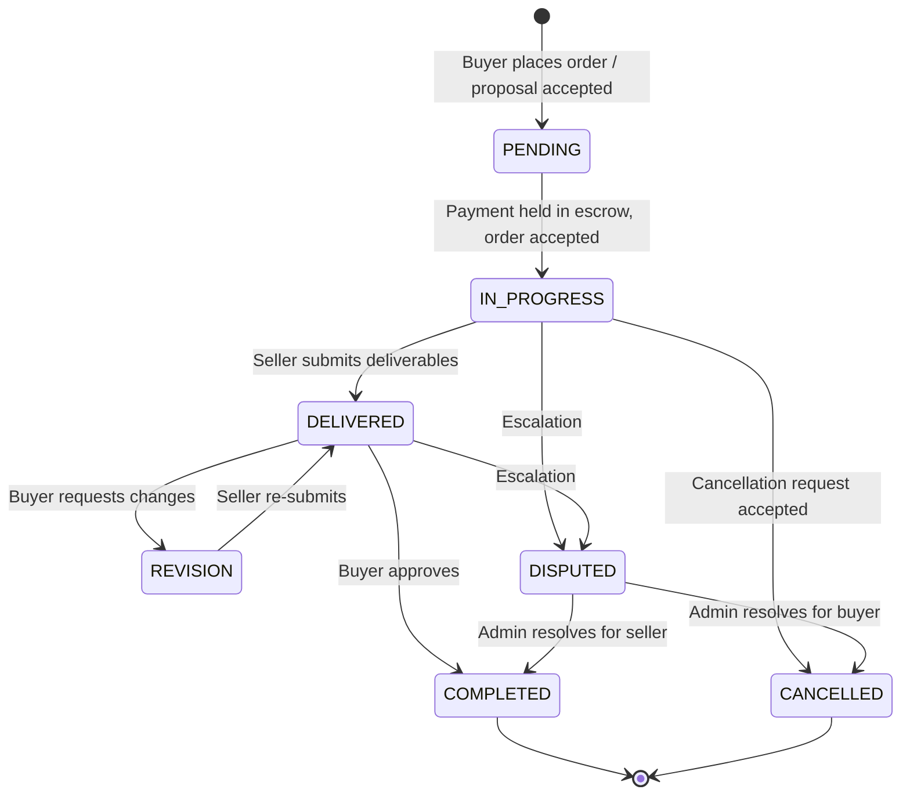
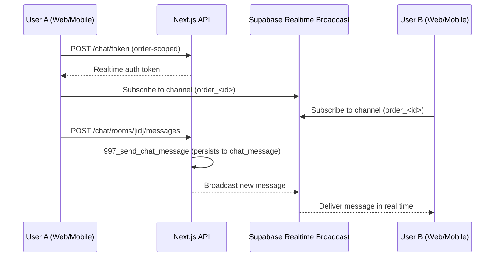
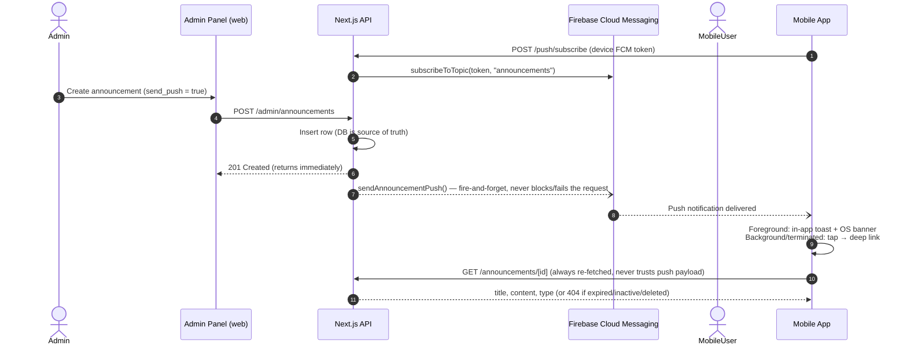
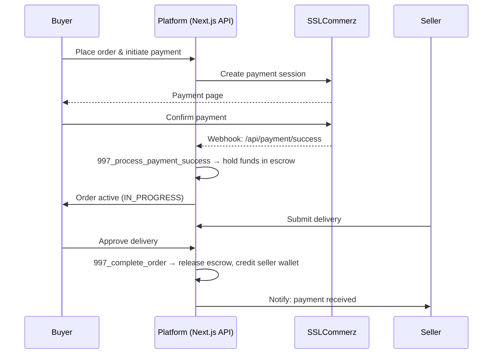

# 6. Workflows & Sequence Diagrams

## 6.1 Authentication & Role-Based Navigation (Mobile)

## 6.2 Gig Order & Escrow Fulfillment Lifecycle

## 6.3 Job Posting & Proposal Selection

## 6.4 Escrow Financial State Machine

## 6.5 Order Lifecycle (`record_status` on `"order"`)

## 6.6 Real-Time Chat Flow

## 6.7 Push Notification Flow (Announcements)

## 6.8 Payment & Escrow Flow (Gateway-level)

