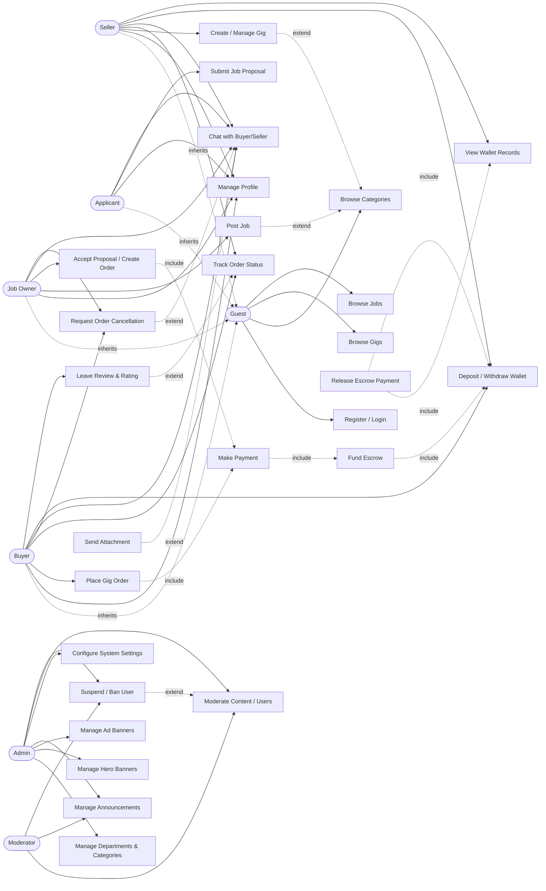

# 9. Use Cases & Actors

> Source: [`web/data/schema/use_cases.json`](../../web/data/schema/use_cases.json) (also available as `use_case_diagram.drawio` / `.puml`). Rendered here as a Mermaid use-case-style flowchart plus a relation table, since Mermaid has no native UML use-case diagram type.

## 9.1 Actors

| Actor                            | Description                                                   |
| -------------------------------- | ------------------------------------------------------------- |
| **Guest**                        | Unauthenticated visitor — base actor other roles inherit from |
| **Buyer** _(inherits Guest)_     | A student placing/tracking gig orders                         |
| **Seller** _(inherits Guest)_    | A student offering gigs                                       |
| **Job Owner** _(inherits Guest)_ | A student posting jobs and selecting proposals                |
| **Applicant** _(inherits Guest)_ | A student submitting job proposals                            |
| **Admin**                        | Platform moderator/operator                                   |
| **Moderator**                    | Content moderation subset of Admin's powers                   |

> Note: Buyer/Seller/Job Owner/Applicant are **not separate accounts** — every authenticated `profile` can act as any of these simultaneously depending on context (see [01-overview-and-features.md §1.2](./01-overview-and-features.md#12-roles)).

## 9.2 Use Cases by Category

| Category         | Use Cases                                                                                                                                                          |
| ---------------- | ------------------------------------------------------------------------------------------------------------------------------------------------------------------ |
| General          | Register/Login, Manage Profile, Browse Categories                                                                                                                  |
| Gig / Seller     | Create/Manage Gig, Browse Gigs, Place Gig Order                                                                                                                    |
| Job              | Post Job, Browse Jobs, Submit Job Proposal, Accept Proposal / Create Order                                                                                         |
| Order Lifecycle  | Track Order Status, Request Order Cancellation, Chat with Buyer/Seller, Send Attachment                                                                            |
| Payments         | Make Payment, Deposit/Withdraw Wallet, Fund Escrow, Release Escrow Payment, View Wallet Records                                                                    |
| Reviews          | Leave Review & Rating                                                                                                                                              |
| Admin/Moderation | Manage Departments & Categories, Manage Hero Banners, Manage Ad Banners, Manage Announcements, Configure System Settings, Moderate Content/Users, Suspend/Ban User |

## 9.3 Actor → Use Case Diagram

## 9.4 Include / Extend Relationships

| Base use case                  | Relationship | Target use case                              | Meaning                                                     |
| ------------------------------ | ------------ | -------------------------------------------- | ----------------------------------------------------------- |
| Place Gig Order                | include      | Make Payment                                 | Every gig order requires payment                            |
| Accept Proposal / Create Order | include      | Make Payment                                 | Accepting a proposal also requires funding                  |
| Make Payment                   | include      | Fund Escrow                                  | Payments always flow into escrow, never direct-to-seller    |
| Fund Escrow                    | include      | Deposit/Withdraw Wallet                      | Escrow funding touches the wallet ledger                    |
| Release Escrow Payment         | include      | View Wallet Records, Deposit/Withdraw Wallet | Releasing escrow writes a wallet record and updates balance |
| Send Attachment                | extend       | Chat with Buyer/Seller                       | Optional add-on to a chat message                           |
| Request Order Cancellation     | extend       | Chat with Buyer/Seller                       | Cancellation flow surfaces through chat notifications       |
| Leave Review & Rating          | extend       | Track Order Status                           | Reviewing is an optional step after order completion        |
| Suspend/Ban User               | extend       | Moderate Content/Users                       | Banning is one possible moderation action                   |
| Create/Manage Gig              | extend       | Browse Categories                            | Gig creation reuses the category browser for selection      |
| Post Job                       | extend       | Browse Categories                            | Job posting reuses the category browser for selection       |
