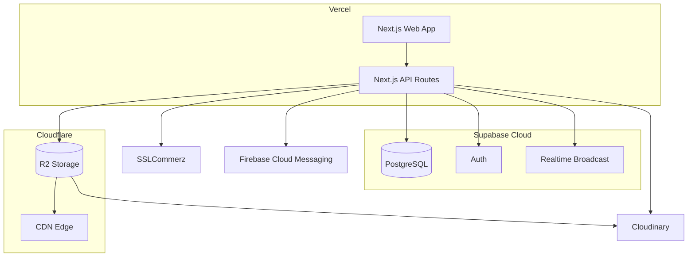
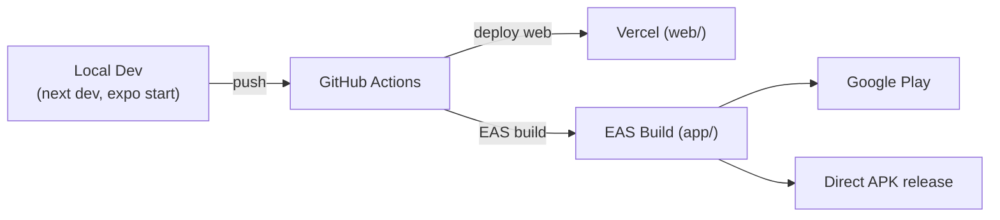

# 10. Deployment & Environments

## 10.1 Web (`web/`)

- **Framework**: Next.js App Router — deployable as a standard Vercel project (Server Components + Serverless API routes in one deployment).
- **Database**: Supabase Cloud (managed PostgreSQL + Auth + Realtime Broadcast) — migrations in `web/schema/*.sql` are applied in numeric-prefix order (see [03-database-schema.md §3.1](./03-database-schema.md#31-migration-order)).
- **File storage**: Cloudflare R2 bucket, fronted by Cloudflare CDN for direct file delivery; also used as the origin source for Cloudinary transformations.
- **Image CDN**: Cloudinary — handles only banners, gig images, avatars.
- **Payments**: SSLCommerz gateway + webhook endpoints (`/api/payment/{initiate,success,fail,cancel}`).
- **Push**: Firebase Admin SDK (`firebase-admin`) — requires `FIREBASE_PROJECT_ID`, `FIREBASE_CLIENT_EMAIL`, `FIREBASE_PRIVATE_KEY` env vars (see `web/config/env.config.ts`, `.env.example`).
- **Scheduled jobs**: `/api/cron/daily-summary` — intended to be invoked by a scheduler (Vercel Cron or equivalent) to run `998_get_db_daily_summary`.

## 10.2 Mobile (`app/`)

- **Build system**: Expo Application Services (EAS) — profiles defined in [`app/eas.json`](../eas.json):
  - `development` — internal distribution, dev client enabled.
  - `preview` — internal distribution, produces an installable APK directly.
  - `production` — auto-incrementing build number, store-ready output (AAB for Play Store).
- **Current app version**: `2.0.2` (`app/package.json`), Expo SDK `^57.0.7` (`app.json` name: `GigHub`).
- **Distribution channels**:
  - Google Play Store (`.aab` upload).
  - Direct APK distribution for sideloading: `app-arm64-v8a-release.apk` (recommended, modern devices), `app-armeabi-v7a-release.apk` (older devices), `app-universal-release.apk` (all devices, larger size).
- **Native project**: `app/android/` is a generated/config-tracked native Android project (Expo config plugins, e.g. `expo-notifications`, are applied here on prebuild).
- **Push credentials**: `app/google-services.json` — must reference the **same Firebase project** as the backend's `firebase-admin` service account for topic push to work end-to-end.
- Build/release step-by-step: [`app/docs/ANDROID_BUILD_GUIDE.md`](../docs/ANDROID_BUILD_GUIDE.md).

## 10.3 Shared Package (`npm-types/`)

- `@gig-hub/types` is versioned and built independently (`npm-types/tsup.config.ts` → `npm-types/dist/`), then consumed by both `web/` and `app/` as a dependency (packed as `gig-hub-types-1.0.0.tgz` for local/offline installs, or published to a registry for CI installs).
- Any change to a Zod schema or DB-mirrored type should be released here **first**, then bumped in both `web/package.json` and `app/package.json`, so both clients stay contract-compatible with the API.

## 10.4 Environment Variables (by surface)

| Surface | Key variables                                                                                                                                                                     |
| ------- | --------------------------------------------------------------------------------------------------------------------------------------------------------------------------------- |
| `web/`  | Supabase URL/keys, `FIREBASE_PROJECT_ID`, `FIREBASE_CLIENT_EMAIL`, `FIREBASE_PRIVATE_KEY`, Cloudflare R2 credentials/bucket, Cloudinary credentials, SSLCommerz store id/password |
| `app/`  | Public API base URL, Supabase public URL/anon key (session bootstrap only — all writes go through the API), `google-services.json` (Firebase)                                     |

> Exact variable names live in `web/config/env.config.ts` / `.env.example` — treat that file as authoritative; do not duplicate secret values into this documentation.

## 10.5 CI/CD (target)

Release notes convention: see [`app/index.md`](../index.md) for the format used for mobile release announcements (e.g. `v1.0.1`).
