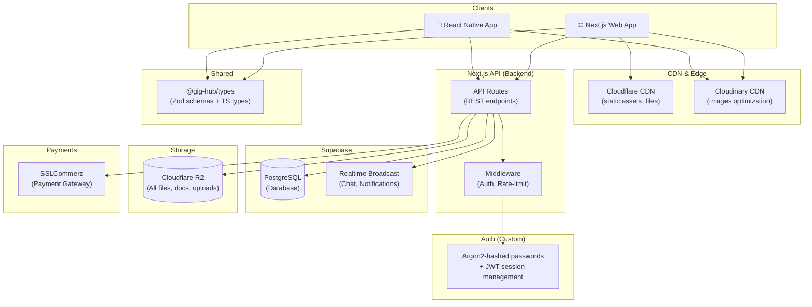
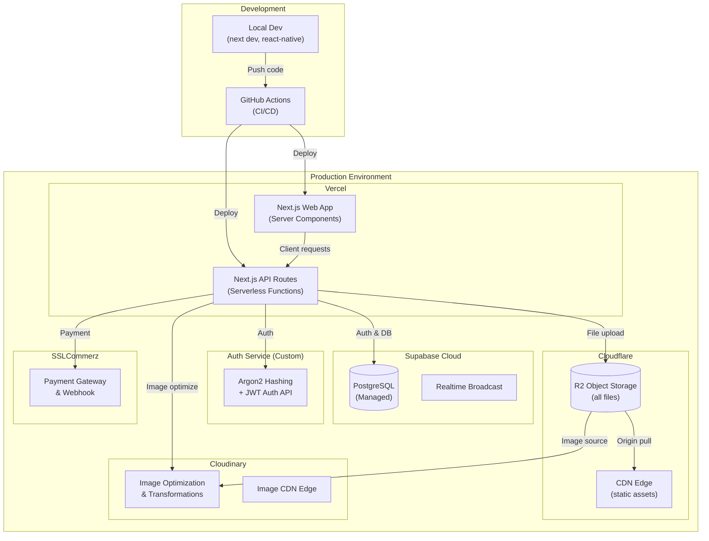
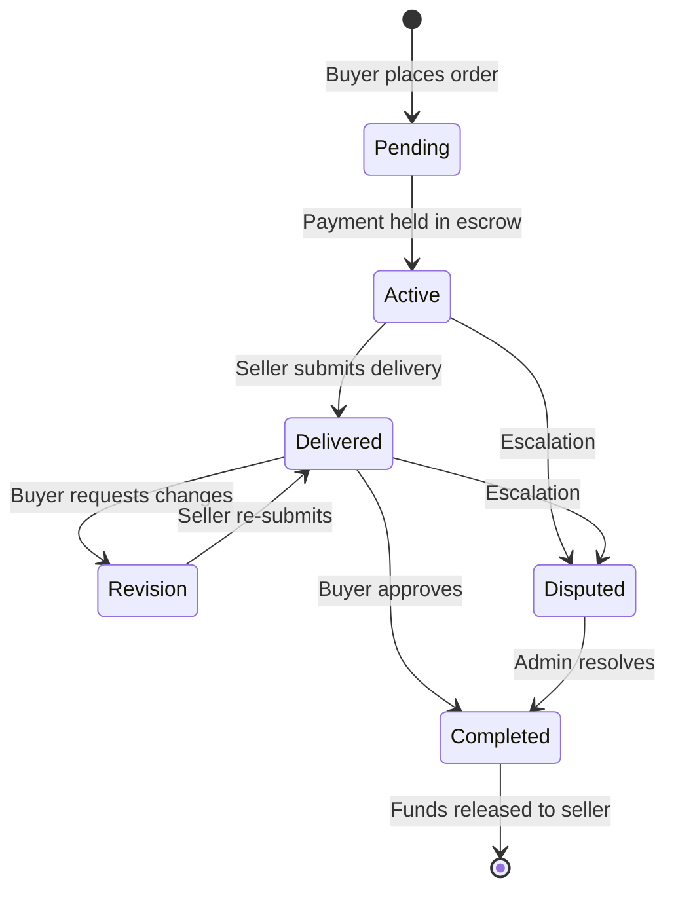
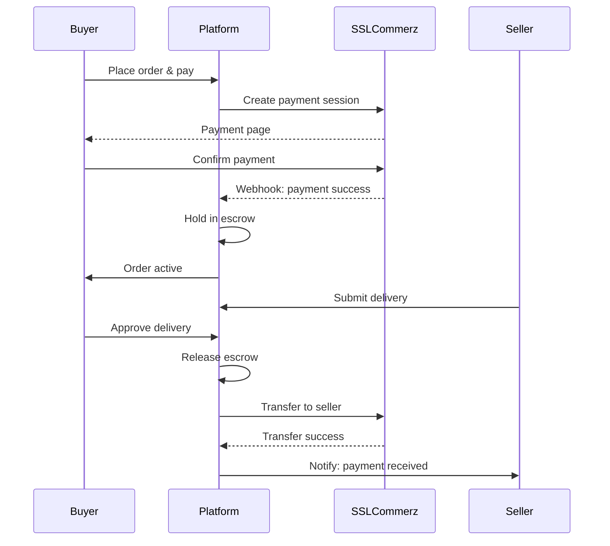
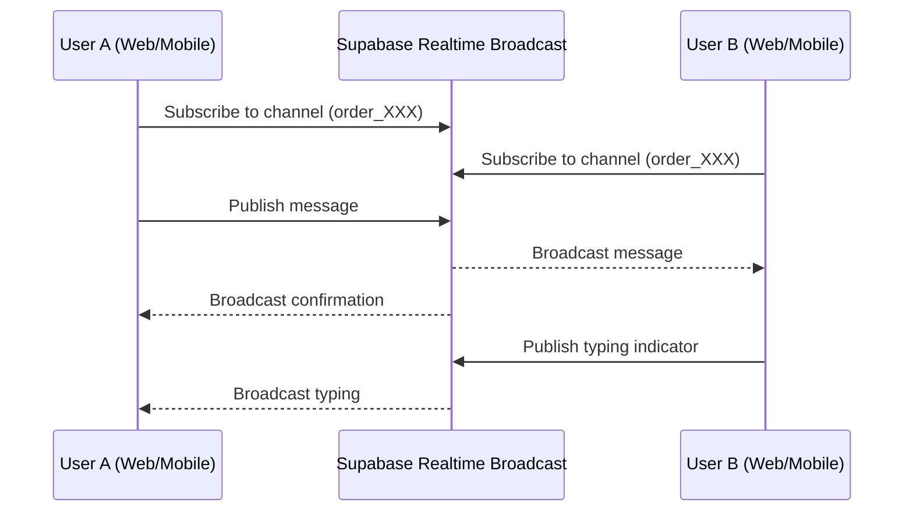
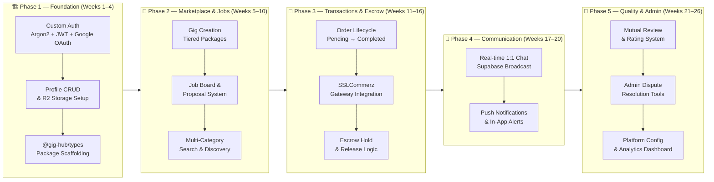

# GigHub : Campus-Centric Freelance & Task Marketplace


<div align="center">

[](https://github.com/ahsanulhoqueabir/GigHub)
[](https://jnu.ac.bd)
[](LICENSE)

<!-- Big action buttons -->
<p align="center">
  <a href="https://gighub.ahsanull.com/">
    
  </a>
  &nbsp;&nbsp;
  <a href="https://github.com/ahsanulhoqueabir/GigHub/releases">
    
  </a>
  &nbsp;&nbsp;
  <a href="https://www.npmjs.com/package/@gig-hub/types">
    
  </a>
</p>

</div>

**GigHub** is a closed, campus-exclusive freelance and task marketplace designed specifically for the students of **Jagannath University (JnU), Dhaka**. It empowers students to monetize their skills, find help for their projects, and build professional portfolios — all within a trusted campus ecosystem with escrow-protected transactions.

---

## 🚀 The Vision

In a world of global competition, GigHub brings the freelance economy home. Every student is a participant in a dual-sided marketplace:

- **No separate roles:** A student is both a service provider (Seller) and a client (Buyer) simultaneously.
- **Campus trust:** Verified identities and local payment methods (bKash, Nagad) ensure safe and reliable transactions.
- **Portfolio building:** Every task completed contributes to a verifiable professional profile within the campus community.

---

## ✨ Key Features

### 🏪 Gig Marketplace (Fiverr-style)

Browse and offer specialized services through a tiered package system.

- 3-tier pricing: **Basic, Standard, and Premium**.
- High-quality galleries with image uploads — files stored in Cloudflare R2, served via Cloudinary CDN for optimized delivery.
- Full-text search and advanced filtering by category, price, and delivery time.

### 📝 Job Board (Upwork-style)

Post specific tasks or projects and receive custom proposals from skilled peers.

- Support for **Paid, Free, Internship, and Volunteer** task types.
- Milestone-based project tracking for complex deliverables.
- Real-time proposal management and selection.

### 🔐 Secure Escrow & Payments

Trust is built-in with an automated escrow system.

- **Escrow protection:** Funds are held securely until the buyer approves the delivery.
- **Local Integration:** Integrated with **SSLCommerz** for seamless local payments.
- **Automated Withdrawals:** Withdraw earnings directly to your mobile banking account.

### 💬 Real-time Communication

- Integrated 1:1 chat for pre-order inquiries and order-specific collaboration.
- Real-time messaging powered by **Supabase Realtime Broadcast**.
- File and image sharing within chat.
- Live notifications for messages, order updates, and payments.

---

## 🛠️ Tech Stack

GigHub is built using a modern, scalable architecture designed for high performance and reliability.

| Layer              | Technology                                                                                                                        |
| :----------------- | :-------------------------------------------------------------------------------------------------------------------------------- |
| **API & Backend**  | [Next.js API Routes](https://nextjs.org/) (TypeScript, REST)                                                                      |
| **Web Frontend**   | [Next.js 14](https://nextjs.org/) (App Router, Server Components)                                                                 |
| **Mobile App**     | [React Native](https://reactnative.dev/) (Android & iOS)                                                                          |
| **Database**       | [Supabase](https://supabase.com/) (PostgreSQL + Realtime Broadcast)                                                               |
| **Authentication** | Custom (Email/Google OAuth, passwords hashed with [Argon2](https://en.wikipedia.org/wiki/Argon2))                                 |
| **File Storage**   | [Cloudflare R2](https://www.cloudflare.com/developer-platform/r2/) — all files (docs, assets, uploads); served via Cloudflare CDN |
| **Image CDN**      | [Cloudinary](https://cloudinary.com/) — only banners, gig images, avatars (image-specific optimization & transformations)         |
| **Shared Types**   | [`@gig-hub/types`](https://www.npmjs.com/package/@gig-hub/types) (Zod schemas + TypeScript types, shared package)                 |
| **Real-time**      | [Supabase Realtime Broadcast](https://supabase.com/docs/guides/realtime/broadcast)                                                |
| **Payments**       | [SSLCommerz](https://sslcommerz.com/)                                                                                             |

---

## 📂 Repository Structure

This branch (`main`) contains **only planning & documentation files**. All source code lives in dedicated branches:

```text
main/                          # ← You are here — Planning & Docs only
├── PRD.md                     # Product Requirements Document (RAD)
├── project-brief.md           # High-level feature overview
├── readme.md                  # This file
└── reports/                   # PDF reports & analysis (optional)

web/                           # Next.js (API + Web Frontend)
├── apps/
│   ├── web/                   # Next.js App Router frontend
│   └── api/                   # Next.js API routes (backend logic)
├── packages/
│   └── @gig-hub/types/        # Shared Zod schemas & TS types (consumed as dep)
├── package.json
└── turbo.json                 # Turborepo config

app/                           # React Native (Mobile App)
├── src/
│   ├── components/
│   ├── screens/
│   └── navigation/
├── package.json
└── ...

shared-types/                  # Standalone NPM package @gig-hub/types
├── src/
│   ├── schemas/               # Zod validation schemas
│   ├── types/                 # TypeScript type definitions
│   └── index.ts
├── package.json
└── tsconfig.json
```

---

## 🏗️ System Architecture

### High-Level Architecture



### Deployment Architecture



### Database Schema (Actual)

```mermaid
erDiagram
    department ||--o{ profile : "belongs_to"
    category ||--o{ category : "has_subcategory"
    category ||--o{ gig : "categorized_as"
    category ||--o{ job : "categorized_as"
    profile ||--o{ gig : "sells"
    profile ||--o{ job : "owns"
    profile ||--o{ job_proposal : "applies"
    profile ||--o{ order : "buys"
    profile ||--o{ order : "sells_as"
    profile ||--o{ chat_room : "buyer_in"
    profile ||--o{ chat_room : "seller_in"
    profile ||--o{ chat_message : "sends"
    profile ||--o{ wallet : "has_wallet"
    profile ||--o{ wallet_record : "transaction"
    profile ||--o{ escrow : "sends_payment"
    profile ||--o{ escrow : "receives_payment"
    profile ||--o{ reviews : "writes"
    profile ||--o{ reviews : "receives"
    gig ||--o{ order : "ordered_as"
    job ||--o{ job_proposal : "has_proposals"
    job ||--o{ order : "ordered_as"
    job_proposal ||--o{ order : "accepted_as"
    order ||--o{ chat_room : "has_chat"
    order ||--o{ escrow : "has_escrow"
    order ||--o{ wallet_record : "payment_log"
    order ||--o{ reviews : "reviewed_in"
    chat_room ||--o{ chat_message : "contains"
    wallet ||--o{ wallet_record : "ledger"

    department {
        uuid id PK
        string name
        string code
        string acronym "nullable"
        string image "nullable"
        string id_pattern "nullable"
        string description "nullable"
        string status "record_status"
        datetime created_at
        datetime updated_at
    }

    category {
        uuid id PK
        string name
        string slug "unique"
        string image "nullable"
        string description "nullable"
        uuid parent FK "nullable, self-ref"
        int ordering
        string status "record_status"
        datetime created_at
        datetime updated_at
    }

    profile {
        uuid id PK
        string name
        string username "unique"
        string password
        string email "unique"
        string role "user_role: USER | ADMIN"
        string phone "nullable"
        string bio "nullable"
        string avatar "nullable, R2 to Cloudinary"
        string cover "nullable, R2 to Cloudinary"
        string skills "nullable, text[]"
        string website "nullable"
        string portfolio "nullable"
        string google "nullable"
        string socials "nullable, json"
        boolean verified
        string fcm_token "nullable"
        uuid department FK "nullable"
        string student_id "nullable"
        string status "record_status"
        datetime created_at
        datetime updated_at
    }

    gig {
        uuid id PK
        uuid seller FK
        uuid category FK
        string title
        string slug "unique"
        string description
        string images "nullable, text[] to Cloudinary"
        string tags "nullable, text[]"
        int views
        string packages "json: Basic | Standard | Premium"
        string faq "nullable, json"
        string status "record_status"
        datetime created_at
        datetime updated_at
    }

    job {
        uuid id PK
        uuid owner FK
        uuid category FK
        string title
        string slug "unique"
        string description
        string attachments "nullable, text[]"
        string type "job_type"
        string budget
        datetime deadline
        string location "nullable"
        string required_skills "nullable, text[]"
        string tags "nullable, text[]"
        int views
        string status "record_status"
        datetime created_at
        datetime updated_at
    }

    job_proposal {
        uuid id PK
        uuid job FK
        uuid applicant FK
        string description
        string attachments "nullable, text[]"
        string status "record_status"
        datetime created_at
        datetime updated_at
    }

    order {
        uuid id PK
        string code "unique"
        uuid buyer FK
        uuid seller FK
        uuid gig FK "nullable"
        uuid job FK "nullable"
        string package "nullable, gig_package_tier"
        uuid proposal FK "nullable"
        string description "nullable"
        string note "nullable"
        string source "order_source: JOB | GIG"
        decimal total_price
        string title
        int amount
        datetime deadline "nullable"
        string cancellation_reason "nullable"
        uuid cancellation_request_by "nullable"
        datetime cancellation_request_at "nullable"
        string status "record_status"
        datetime created_at
        datetime updated_at
    }

    chat_room {
        uuid id PK
        uuid order FK
        uuid buyer FK
        uuid seller FK
        string title "nullable"
        string status "record_status"
        datetime created_at
        datetime updated_at
    }

    chat_message {
        uuid id PK
        uuid room FK
        uuid sender FK
        string content "nullable"
        string attachment_url "nullable, R2"
        string attachment_name "nullable"
        string attachment_type "nullable"
        string status "record_status"
        datetime created_at
        datetime updated_at
    }

    wallet {
        uuid id PK
        string name
        uuid user FK
        decimal balance
        string currency
        string status "record_status"
        datetime created_at
        datetime updated_at
    }

    escrow {
        uuid id PK
        uuid order FK
        uuid sender FK
        uuid receiver FK
        decimal amount
        decimal platform_fee
        datetime released_at "nullable"
        datetime auto_released_at "nullable"
        string note "nullable"
        string payment_status
        string payment_method "nullable"
        string transaction_id "nullable"
        datetime disputed_at "nullable"
        datetime resolved_at "nullable"
        uuid resolved_by "nullable"
        string dispute_reason "nullable"
        string admin_note "nullable"
        string status "record_status"
        datetime created_at
        datetime updated_at
    }

    wallet_record {
        uuid id PK
        uuid wallet FK
        decimal amount
        string type "wallet_record_type: CREDIT | DEBIT"
        string description "nullable"
        string metadata "nullable, json"
        string note "nullable"
        uuid order FK "nullable"
        uuid escrow FK "nullable"
        string payment_method
        string transaction_id "nullable"
        string payment_gateway
        string status "record_status"
        datetime created_at
        datetime updated_at
    }

    reviews {
        uuid id PK
        uuid reviewer FK
        uuid gig FK
        uuid seller FK
        uuid order FK "unique"
        int rating "1-5"
        string note "nullable"
        datetime created_at
        datetime updated_at
    }

    system_config {
        boolean id PK
        boolean maintenance_mode
        boolean registration_enabled
        decimal platform_fee_percent
        int max_gig_images
        int max_portfolio_images
        int max_upload_size_mb
        string support_email "nullable"
        string support_phone "nullable"
        datetime created_at
        datetime updated_at
    }

    hero_banners {
        uuid id PK
        string title
        string subtitle "nullable"
        string image_url "Cloudinary"
        string alt_text
        string button_text "nullable"
        string button_url "nullable"
        int sort_order
        boolean is_active
        datetime starts_at "nullable"
        datetime ends_at "nullable"
        datetime created_at
        datetime updated_at
    }

    ad_banners {
        uuid id PK
        string name
        string placement
        string image_url "Cloudinary"
        string alt_text
        string target_url "nullable"
        int sort_order
        boolean is_active
        datetime starts_at "nullable"
        datetime ends_at "nullable"
        datetime created_at
        datetime updated_at
    }

    announcements {
        uuid id PK
        string title
        string content
        string type "nullable"
        boolean is_active
        boolean send_push "nullable"
        datetime starts_at "nullable"
        datetime ends_at "nullable"
        datetime created_at
        datetime updated_at
    }
```



### System Flow Diagrams (Placeholder)

**Order Lifecycle Flow:**



**Payment & Escrow Flow:**



**Real-time Chat Flow:**



---

### 🔑 Auth & Data Flow

1. Student authenticates via **Custom Auth** (Email/Google OAuth, passwords hashed with Argon2).
2. Next.js API routes verify the JWT session and resolve the user to `profiles.id`.
3. All platform data is stored in **Supabase (PostgreSQL)**.
4. **Supabase Realtime Broadcast** handles live chat & notifications — no separate WebSocket server needed.
5. All files are uploaded to **Cloudflare R2** (served via Cloudflare CDN); **Cloudinary** handles only image-specific optimization (banners, gig images, avatars).
6. Shared Zod schemas & TypeScript types live in [`@gig-hub/types`](https://www.npmjs.com/package/@gig-hub/types) — consumed by both `web` and `app`.
7. Mobile app can be downloaded from the [GitHub Releases](https://github.com/ahsanulhoqueabir/GigHub/releases) section.

---

## 🗺️ Implementation Roadmap



### 📋 Phase Details

| Phase                     | Sprints      | Focus                 | Deliverables                                                                     |
| :------------------------ | :----------- | :-------------------- | :------------------------------------------------------------------------------- |
| **🏗️ P1 — Foundation**    | Sprint 1–2   | Auth, Profiles, Types | Custom Auth (Argon2 + JWT), Profile CRUD, R2 setup, `@gig-hub/types` scaffolding |
| **🛒 P2 — Marketplace**   | Sprint 3–5   | Gigs, Jobs, Search    | Gig CRUD + packages, Job board + proposals, Search & filters                     |
| **💸 P3 — Transactions**  | Sprint 6–8   | Orders, Payments      | Order lifecycle, SSLCommerz, Escrow hold/release logic                           |
| **📢 P4 — Communication** | Sprint 9–10  | Chat, Notifications   | Supabase Realtime Chat, Push notifications                                       |
| **💎 P5 — Quality**       | Sprint 11–13 | Reviews, Admin        | Ratings system, Admin panel, Dispute resolution, Dashboard                       |

---

## 🔗 Quick Links

| Resource            | Link                                                                   |
| :------------------ | :--------------------------------------------------------------------- |
| 🌐 **Website**      | [gighub.ahsanull.com](https://gighub.ahsanull.com/)                    |
| 📦 **npm Package**  | [`@gig-hub/types`](https://www.npmjs.com/package/@gig-hub/types)       |
| 📱 **Download App** | [GitHub Releases](https://github.com/ahsanulhoqueabir/GigHub/releases) |
| 🐙 **GitHub Repo**  | [ahsanulhoqueabir/GigHub](https://github.com/ahsanulhoqueabir/GigHub)  |

---

## 🤝 Contributing

This is an internal project for the Jagannath University community. If you are a JnU student and wish to contribute, please refer to our internal onboarding guide or contact the core team.

---

## 📄 License

This documentation and the project codebase are licensed under the [MIT License](LICENSE).

---

Developed with ❤️ for **Jagannath University** students.
